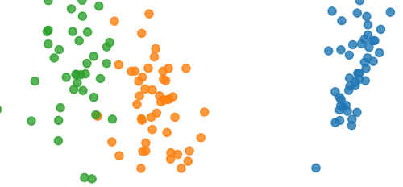

## Homework2  基于 PCA/LDA 和 KNN 的人脸识别

### 实验目的

1. 熟悉并掌握 PCA、LDA 的基本原理，并应用 PCA 和 LDA 实现数据降维
2. 熟悉利用 KNN 分类器对样本进行分类

### 实验要求

1. 提交实验报告，要求有适当步骤说明和结果分析
2. 将代码和结果打包提交
3. 不能直接调用现有的库函数提供的 PCA、LDA、KNN 接口

### 实验内容

1. 自己实现 PCA 和 LDA 数据降维算法以及 KNN 分类器
2. 利用实现的两种降维算法对数据进行降维
3. 利用降维后的结果，用 KNN 进行训练和测试

### 实验过程

#### 实现 PCA 函数接口

实现一个你自己的 PCA 函数。PCA 函数的主要流程是：先对计算数据的协方差矩阵，然后在对协方差矩阵进行 SVD 分解，得到对应的特征值和特征向量。

#### 实现 LDA 函数接口

实现一个你自己的 LDA 函数。LDA 函数的主要流程是：将样本数据按照类别进行分组，计算每个类别样本的均值向量。计算类内散度矩阵与类间散度矩阵，利用二者得到投影矩阵，并用其进行数据降维。

#### 利用数据降维算法对输入数据进行降维`

读取 yale face 数据集 `Yale\_64x64.mat`，将数据集划分为训练和测试集，数据集读取和划分代码如下。

```python
from scipy import io
x = io.loadmat('Yale_64x64.mat')
ins_perclass, class_number, train_test_split = 11, 15, 9
input_dim = x['fea'].shape[1]
feat = x['fea'].reshape(-1, ins_perclass, input_dim)
label = x['gnd'].reshape(-1, ins_perclass)
train_data, test_data = feat[:, :train_test_split, :].reshape(-1,input_dim), feat[:, train_test_split:, :].reshape(-1,input_dim)
train_label, test_label = label[:, :train_test_split].reshape(- 1), label[:, train_test_split:].reshape(-1)
```

只用训练集数据来学习 PCA 和 LDA 算法中的投影矩阵，并分别将两个方法相应的前 8 个特征向量变换回原来图像的大小进行显示。

然后对训练和测试数据用 PCA 和 LDA 分别进行数据降维（使用所学习的投影矩阵）。

最后对采取 reduced\_dim=2，即降维到 2 维后的训练和测试数据进行可视化，展示降维的效果（例如用第一维做 x，第二维做 y，不同类别采用不同颜色绘制散点图，这里只表示三类的情况，报告中应该是 15 个类）

<center class ='img'>

</center>

#### 利用 KNN 算法进行训练和测试

利用降维后的训练数据作为 KNN 算法训练数据，降维后的测试数据作为评估 KNN 分类效果的测试集，分析在测试集上的准确率（压缩后的维度对准确率的影响，至少要给出压缩到 8 维的准确率）。

拓展：尝试利用不同的分类器，如 SVM 等达到更好的准确率。此部分允许调库。
