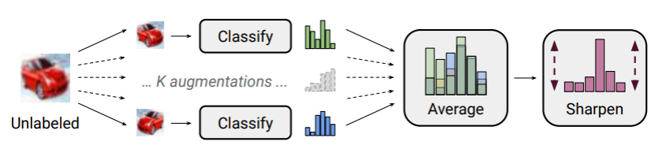
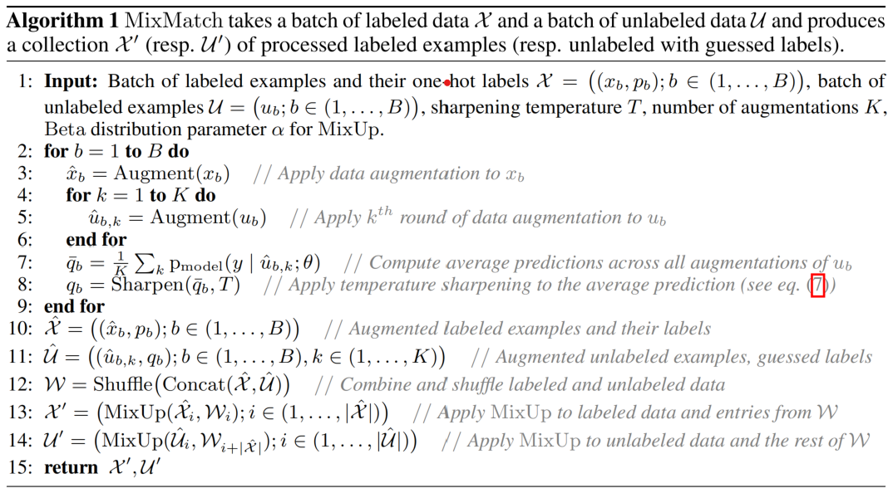
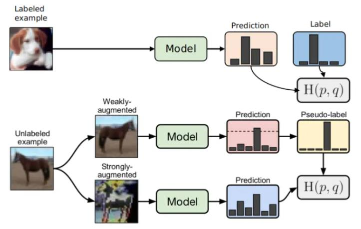
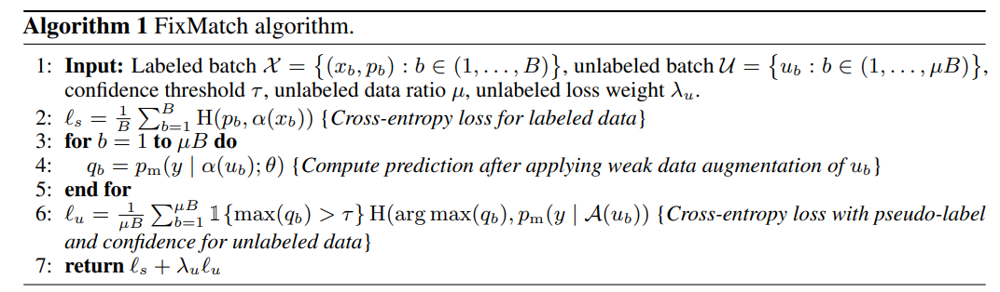

## Homework3  基于 PCA/LDA 和 KNN 的人脸识别

### 实验目的

#### 关于半监督学习

神经网络模型通常需要大量标记好的训练数据来训练模型。然而，在许多情况下，获取大量标记好的数据可能是困难、耗时或昂贵的。这就是半监督学习的应用场景。半监督学习的核心思想是利用无标记数据的信息来改进模型的学习效果。在半监督学习中，我们使用少量标记数据进行有监督学习，同时利用大量无标记数据的信息。通过充分利用无标记数据的潜在结构和分布特征，半监督学习可以帮助模型更好地泛化和适应未标记数据。关于深度学习中半监督学习更全面的总结，可以参考深度学习半监督学习综述[^1]。

#### 半监督图像分类

半监督学习在图像分类取得了非常大的进步，涌现了许多经典的半监督图像分类算法，如：$\pi$Model[^2]，Mean Teacher[^3]，MixMatch[^4]，FixMatch[^5] 等。这些算法都取得了非常好的结果，能够在仅使用少量标注数据的情况下，实现高精度的图像分类，在 ImageNet，CIFAR-10，CIFAR-100 等数据集上都有非常不错的效果。TorchSSL[^6] 是微软发布的一个用于半监督深度学习的库，其中提供了许多半监督学习算法的实现，如下表所示：

##### CIFAR-10 and CIFAR-100

|                  |                | CIFAR-10       |                |  |                | CIFAR100       |                |
| ---------------- | -------------- | -------------- | -------------- | - | -------------- | -------------- | -------------- |
|                  | 40             | 250            | 4000           |  | 400            | 2500           | 10000          |
| FullySupervised  | 95.38$\pm$0.05 | 95.39$\pm$0.04 | 95.38$\pm$0.05 |  |                |                |                |
| PiModel[^2]      | 25.66$\pm$1.76 | 53.76$\pm$1.29 | 86.87$\pm$0.59 |  | 13.04$\pm$0.8  | 41.2$\pm$0.66  | 63.35$\pm$0.0  |
| PseudoLabel      | 25.39$\pm$0.26 | 53.51$\pm$2.2  | 84.92$\pm$0.19 |  | 12.55$\pm$0.85 | 42.26$\pm$0.28 | 63.45$\pm$0.24 |
| PseudoLabel_Flex | 26.26$\pm$1.96 | 53.86$\pm$1.81 | 85.25$\pm$0.19 |  | 14.28$\pm$0.46 | 43.88$\pm$0.51 | 64.4$\pm$0.15  |
| MeanTeacher[^3]  | 29.91$\pm$1.6  | 62.54$\pm$3.3  | 91.9$\pm$0.21  |  | 18.89$\pm$1.44 | 54.83$\pm$1.06 | 68.25$\pm$0.23 |
| VAT              | 25.34$\pm$2.12 | 58.97$\pm$1.79 | 89.49$\pm$0.12 |  | 14.8$\pm$1.4   | 53.16$\pm$0.79 | 67.86$\pm$0.19 |
| MixMatch[^4]     | 63.81$\pm$6.48 | 86.37$\pm$0.59 | 93.34$\pm$0.26 |  | 32.41$\pm$0.66 | 60.24$\pm$0.48 | 72.22$\pm$0.29 |
| ReMixMatch       | 90.12$\pm$1.03 | 93.7$\pm$0.05  | 95.16$\pm$0.01 |  | 57.25$\pm$1.05 | 73.97$\pm$0.35 | 79.98$\pm$0.27 |
| UDA              | 89.38$\pm$3.75 | 94.84$\pm$0.06 | 95.71$\pm$0.07 |  | 53.61$\pm$1.59 | 72.27$\pm$0.21 | 77.51$\pm$0.23 |
| UDA_Flex         | 94.56$\pm$0.52 | 94.98$\pm$0.07 | 95.76$\pm$0.06 |  | 54.83$\pm$1.88 | 72.92$\pm$0.15 | 78.09$\pm$0.1  |
| FixMatch[^5]     | 92.53$\pm$0.28 | 95.14$\pm$0.05 | 95.79$\pm$0.08 |  | 53.58$\pm$0.82 | 71.97$\pm$0.16 | 77.8$\pm$0.12  |
| FlexMatch        | 95.03$\pm$0.06 | 95.02$\pm$0.09 | 95.81$\pm$0.01 |  | 60.06$\pm$1.62 | 73.51$\pm$0.2  | 78.1$\pm$0.15  |

### 实验内容

#### 1. 基于 MixMatch 的 CIFAR-10 数据集半监督图像分类

MixMatch 采用两种方式来利用无标注数据，即**熵最小化**和**一致性正则化**。具体来说，MixMatch 首先对无标注数据进行 K 次增广，并获得对应的 K 个输出，并计算模型平均的预测分布，之后，MixMatch 使用一个“sharpening”函数来对无标注数据的平均预测进行锐化，并把锐化后的预测分布作为该无标注数据的标签。获得对无标注数据的标签后，将标注数据和无标注数据结合起来，通过 Mixup 的方式完成新数据集的构建，最后使用新的数据集进行训练。

#### 2. 基于 FixMatch 的 CIFAR-10 数据集半监督图像分类

FixMatch 结合了**伪标签**和**一致性正则化**来实现对无标注数据的高效利用，训练过程包括两个部分，有监督训练和无监督训练。有标注的数据，执行有监督训练，和普通分类任务训练没有区别。没有标注的数据，首先将其经过弱增强之后送到模型中推理获取伪标签，然后再将其经过强增强送到模型中进行预测，并利用生成的伪标签监督模型对强增强数据的预测。模型对弱增强数据的预测，只有大于一定阈值条件时才执行伪标签的生成，并使用该伪标签来进行无标注图像的训练。

### 实验要求

1. 阅读原始论文和相关参考资料，基于 Pytorch 分别实现 MixMatch 和 FixMatch 半监督图像分类算法，按照原始论文的设置，MixMatch 和 FixMatch 均使用 WideResNet-28-2 作为 Backbone 网络，即深度为 28，扩展因子为 2， 在 CIFAR-10 数据集上进行半监督图像分类实验，报告算法在分别使用 40, 250, 4000 张标注数据的情况下的图像分类效果（标注数据随机选取指定数量）。
2. 使用 TorchSSL[^6] 中提供的 MixMatch 和 FixMatch 的实现进行半监督训练和测试，对比自己实现的算法和 TorchSSL 中的实现的效果。
3. 提交源代码，不需要包含数据集，并提交实验报告，实验报告中应该包含代码的使用方法，对数据集数据的处理步骤以及算法的主要实现步骤，并分析对比 MixMatch 和 FixMatch 的相同点和不同点。

[^1]: A Survey on Deep Semi-supervised Learning 2021
    
[^2]: Temporal Ensembling for Semi-Supervised Learning
    
[^3]: Mean teachers are better role models: Weight-averaged consistency targets improve semi-supervised deep learning results
    
[^4]: Mixmatch: A holistic approach to semi-supervised learning
    
[^5]: Fixmatch: Simplifying semi-supervised learning with consistency and confidence
    
[^6]: https://github.com/StephenStorm/TorchSSL
