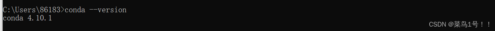
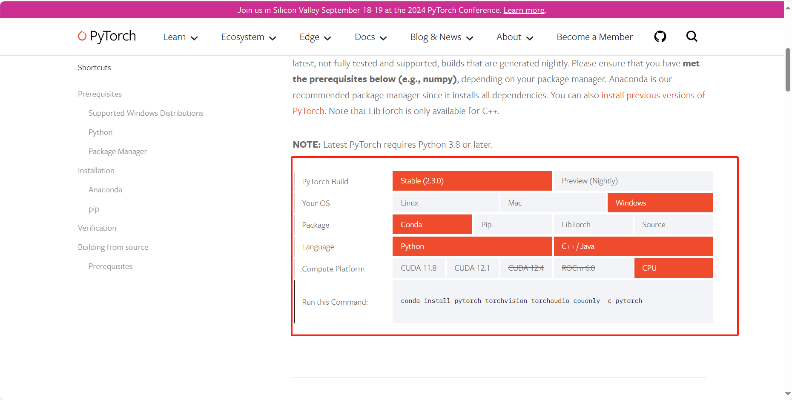

## Pytorch 简单使用及 Homework3 介绍

### 准备工作

#### Anaconda 安装

一个个安装 package 很麻烦，而且很容易出现包之间的依赖不适配的问题。 Anaconda可以很好的解决这类问题，它集成了常用于科学分析（机器学习， 深度学习）的大量package，并且借助于conda我们可以实现对虚拟Python环境的管理。

[Anaconda超详细安装教程（Windows环境下）\_conda安装-CSDN博客](https://blog.csdn.net/fan18317517352/article/details/123035625)

检测是否安装成功

<center class ='img'>

</center>

#### Pytorch 安装

[Pytorch官网](https://pytorch.org/get-started/locally/)

[创建conda虚拟环境](https://blog.csdn.net/qq_27386899/article/details/129461694)，并选择合适的命令在虚拟环境中安装pytorch

<center class ='img'>

</center>

检测pytorch是否安装成功

```python
import torch

print(torch.__version__) # pytorch版本
print(torch.version.cuda) # cuda版本
print(torch.cuda.is_available()) # 查看cuda是否可用
```

### 基本使用

#### Tensor使用

Tensor张量是Pytorch里最基本的数据结构。直观上来讲，它是一个多维矩阵，支持GPU加速，其基本数据类型如下


| 数据类型      | CPU tensor       | GPU tensor            |
| ------------- | ---------------- | --------------------- |
| 8位无符号整型 | torch.ByteTensor | torch.cuda.ByteTensor |
| 8位有符号整型 | torch.CharTensor | torch.cuda.CharTensor |

[简易教程](https://colab.research.google.com/drive/1FERNv6t8xpX9Nly_JdnePWEPllI7F3Fx?usp=sharing#scrollTo=urI46YyRSL0I)

### GPU加速

#### 为什么用GPU

CPU和GPU设计目标不同，分别针对了两种不同的应用场景。

CPU需要很强的通用性来处理各种不同的数据类型，同时又要逻辑判断又会引入大量的分支跳转和中断的处理。这些都使得CPU的内部结构异常复杂。GPU面对的则是类型高度统一的、相互无依赖的大规模数据和不需要被打断的纯净的计算环境。

GPU采用了数量众多的计算单元和超长的流水线，但只有非常简单的控制逻辑并省去了Cache。而CPU不仅被Cache占据了大量空间，而且还有有复杂的控制逻辑和诸多优化电路，相比之下计算能力只是CPU很小的一部分。

<center class ='img'>

</center>

#### 怎么用GPU训练

1. 安装显卡驱动（一般都已经安装）
2. 根据驱动显示支持的cuda版本安装cuda
3. 安装对应的cudnn
4. 在代码中将计算移动到GPU上

[cuda环境教程](https://blog.csdn.net/qq_40379132/article/details/124869378)

### 作业三

1. 基于Pytorch分别实现 MixMatch 和 FixMatch 半监督图像分类算法，按照原始论文的设置，在 CIFAR-10 数据集上进行半监督图像分类实验，报告算法在分别使用40，250，4000张标注数据的情况下的图像分类效果
2. 使用[TorchSSL](https://github.com/StephenStorm/TorchSSL)中提供的 MixMatch 和 FixMatch 的实现进行半监督训练和测试，对比自己实现的算法和TorchSSL中的实现的效果
3. 提交源代码，不需要包含数据集，并提交实验报告，实验报告中应该包含代码的使用方法，对数据集数据的处理步骤以及算法的主要实现步骤，分析对比 MixMatch 和 FixMatch 的相同点和不同点。

#### 硬性要求

1. 鉴于部分同学没有GPU可以使用，统一要求训练的迭代数为20000和batch大小为64，所有报告结果都是基于此设置。
2. 报告中必须包含对 MixMatch 和 FixMatch 方法的解读（结合代码)
3. 作业三要求内容全部完成

#### 加分项

1. 可以完成GPU环境的配置，并成功用于加速训练（需要CPU，GPU训练时常比较与截图）
2. 对方法中的组件进行细致的分析，采取不同超参数对准确率的影响

#### TorchSSL没有实现CPU训练

官方代码进行修改，取消所有移动tensor到GPU上的操作

给出了`./FixMatch.py`和`./model/FixMatch.py`的CPU版本，MixMatch可以同学参照修改为CPU版本

### 参考文章

* [pytorch入门教程](https://blog.csdn.net/ccaoshangfei/article/details/126074300)
* [GPU与CPU区别](https://blog.csdn.net/shuiyixin/article/details/82915378)
